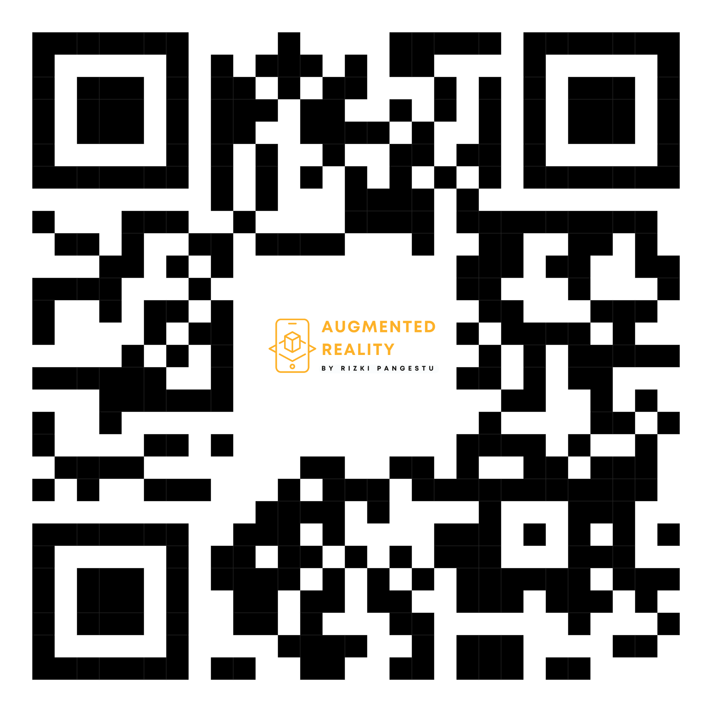

# Project Augmented Reality

<p align="center">
  
</p>

Selamat datang di repository proyek Augmented Reality! Ini adalah Image Tracking merupakan salah satu teknik kunci dalam teknologi AR. Teknik ini memungkinkan perangkat AR untuk mengenali dan melacak gambar tertentu di dunia nyata, kemudian menambahkan elemen digital di atas gambar tersebut. Dengan Image Tracking, perangkat AR dapat mendeteksi pola atau fitur unik dari gambar yang telah diprogram sebelumnya, memproses informasi tersebut, dan menambahkan konten digital secara akurat di lokasi yang tepat.

## Demo Video

Tonton video demo di bawah ini untuk melihat bagaimana proyek ini bekerja:

<p align="center">
  <a href="https://youtu.be/bQGo939faqs">
    
  </a>
</p>

## Dokumentasi

Berikut adalah beberapa cuplikan layar dari aplikasi:

### Dokumentasi 1
<p align="center">
  
</p>

### Dokumentasi 2
<p align="center">
  
</p>

### Dokumentasi 3
<p align="center">
  
</p>

### Dokumentasi 4
<p align="center">
  
</p>

## Kode QR

Pindai kode QR di bawah ini untuk mengakses proyek ini langsung dari ponsel Anda:

<p align="center">
  
</p>

## Instalasi

Ikuti langkah-langkah di bawah ini untuk menginstal proyek ini di mesin lokal Anda.

```bash
git clone https://github.com/rizkipgt/AR-App.git
cd AR-App
npm install
npm start
```
##
Terima kasih telah menggunakan Proyek Awesome! Jangan lupa untuk memberikan ⭐ jika Anda menyukai proyek ini!
