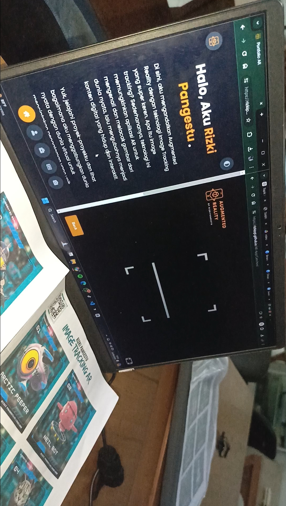
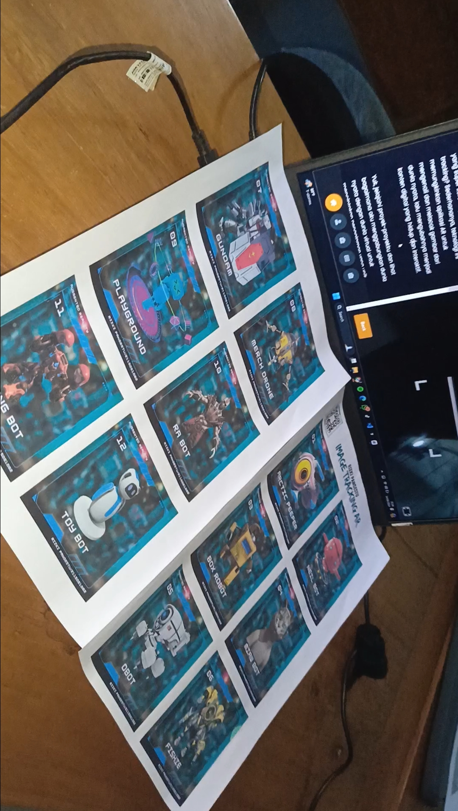
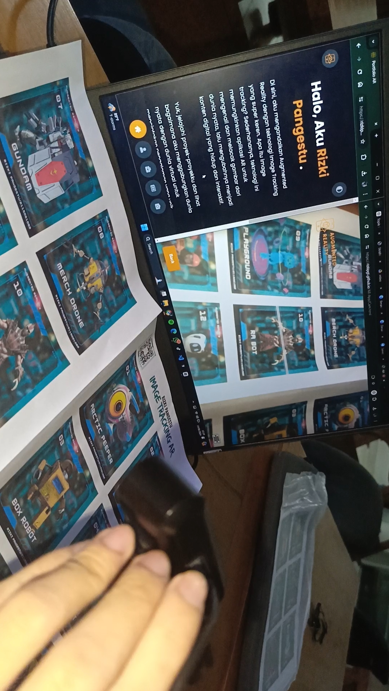
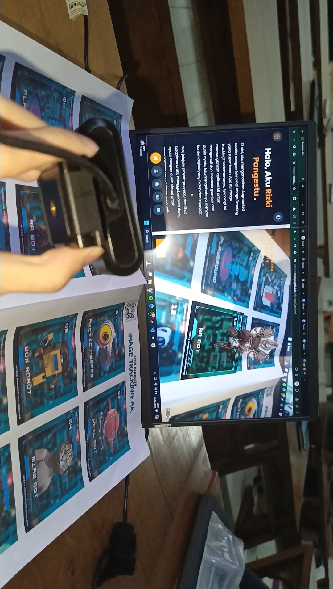

# Proyek Awesome


Selamat datang di repository proyek Awesome! Proyek ini adalah [deskripsi singkat proyek].

## Demo Video

Tonton video demo di bawah ini untuk melihat bagaimana proyek ini bekerja:

[](videos/artutorial.mp4)

## Screenshot

Berikut adalah beberapa cuplikan layar dari aplikasi:

### Halaman Utama


### Fitur A


### Fitur B


### Fitur C


## Kode QR

Pindai kode QR di bawah ini untuk mengakses proyek ini langsung dari ponsel Anda:


## Instalasi

Ikuti langkah-langkah di bawah ini untuk menginstal proyek ini di mesin lokal Anda.

```bash
git clone https://github.com/username/awesome-project.git
cd awesome-project
npm install
npm start
